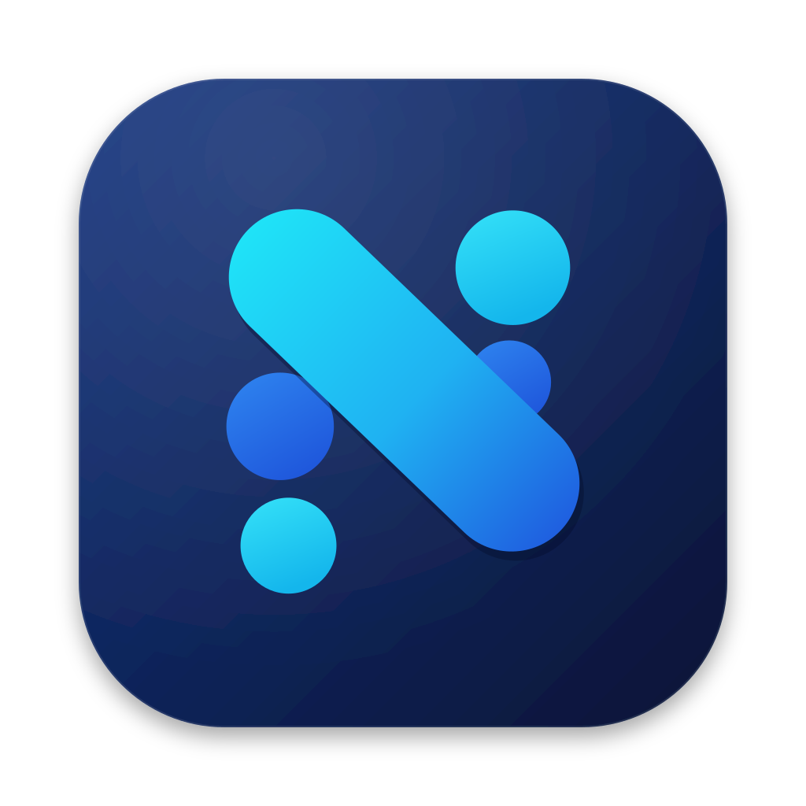
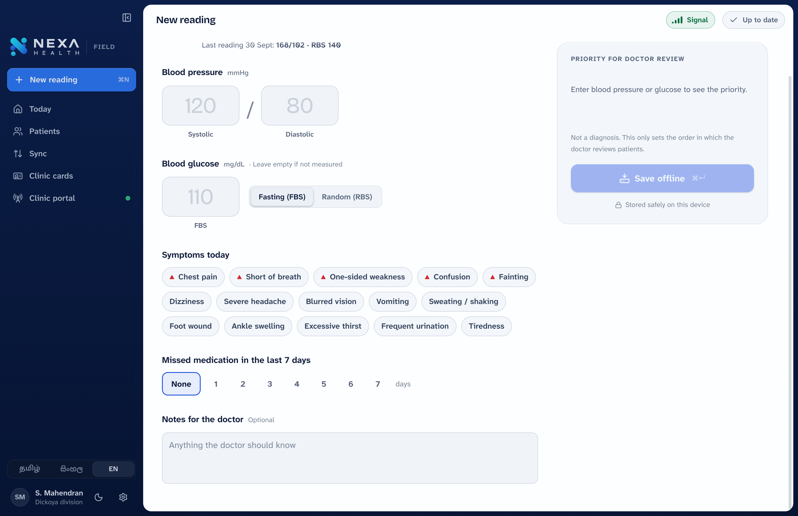
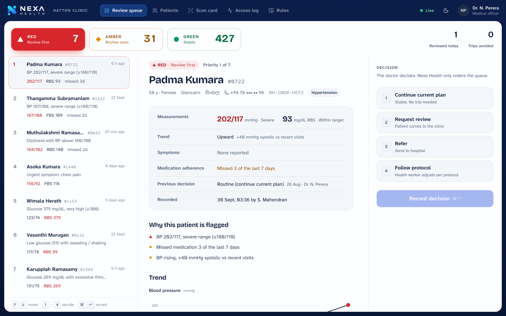
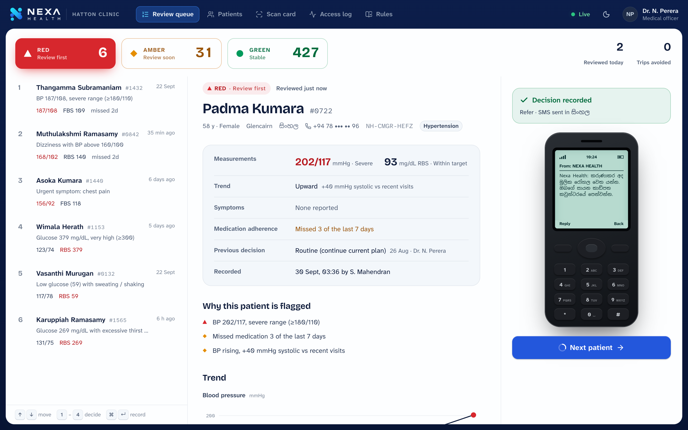
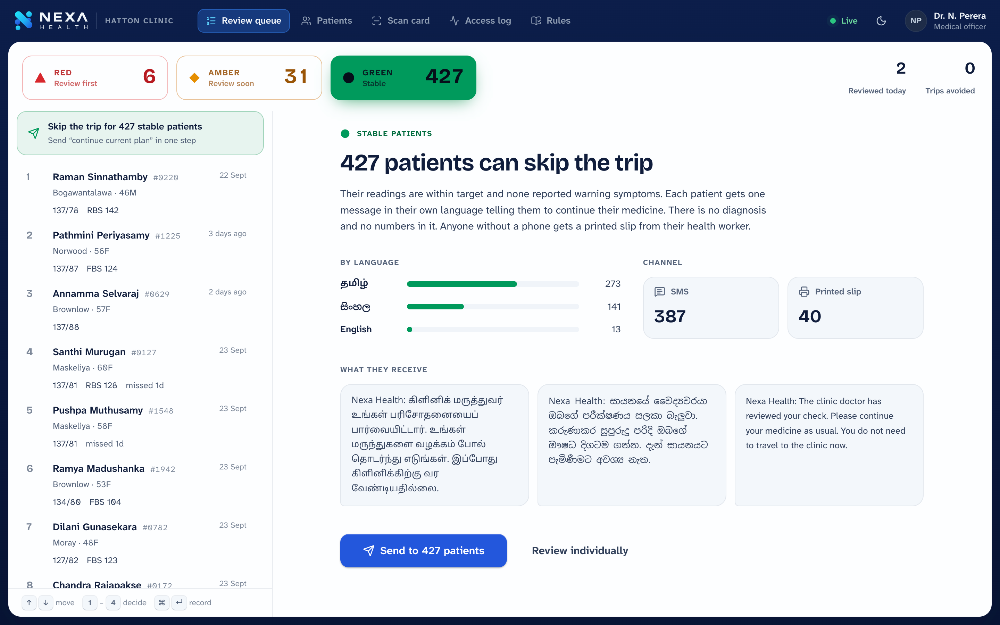

<div align="center">
  
  <h1>Nexa Health</h1>
  <p><b>Offline triage for chronic disease in rural Sri Lanka.</b><br/>
  Health workers record readings with no signal. Nexa Health flags who is getting worse, and the doctor sees who to review first.</p>
  <p>
    <a href="../../releases/latest"><b>Download for macOS or Windows →</b></a>
  </p>
</div>

---

**Nexa Health** gives rural clinics one connected view of their chronic-disease patients. It starts with **diabetes and hypertension on the estates** and is built to extend to other conditions.

| Health worker app (works offline) | Doctor's clinic portal (web) |
|---|---|
|  |  |

## The problem

A diabetic estate worker loses a day's wage and pays for transport to hear "your readings are fine", while a patient whose sugar is dangerously high waits in the same queue, or never comes. Rural areas have **1 medical officer per 1,850 people** (Colombo: 1 per 420). Everyone in the queue is treated the same, records are scattered, and nobody watches patients between visits.

## How Nexa Health works

1. **Record.** The health worker enters BP, glucose, symptoms and missed doses. It works with **no signal** and saves on the device.
2. **Sync.** When signal returns, records upload in signed batches (HMAC-SHA256 per device).
3. **Flag.** Fixed rules from published guidelines mark each patient **red, amber or green**. This is *not AI* and never diagnoses. Every flag lists the exact rule that fired.
4. **Decide.** The doctor sees red patients first. With the keyboard, one patient takes a few seconds. Green patients can be cleared in one step ("skip the trip").
5. **Inform.** The patient gets a short SMS **in Sinhala, Tamil or English**, with no diagnosis and no numbers. Patients without a phone get a printed slip.

| Decision → SMS on a basic phone | Skip the trip for every stable patient |
|---|---|
|  |  |

Also included: **QR clinic cards** (the QR holds a random ID only), an **access log** of every record opened, **consent** at registration, a bright **Daylight theme** by default (easy to read outdoors) with a **Night theme** for low light, and the full **rulebook** inside the app.

---

## Install

Download from the [**latest release**](../../releases/latest).

### macOS (Apple Silicon and Intel)

1. Open `Nexa-Health-x.y.z-mac.dmg` and drag **Nexa Health** into **Applications**.
2. The first time you open it, macOS will say it can't verify the developer, because the app isn't notarised with a paid Apple account.
   - Open **System Settings → Privacy & Security**, scroll down, and click **Open Anyway** next to Nexa Health, **or**
   - in Terminal, run `xattr -cr "/Applications/Nexa Health.app"` and then open it normally.

You only need to do this once.

### Windows 10 / 11

1. Run `Nexa-Health-x.y.z-windows-setup.exe`.
2. If **Windows protected your PC** appears, click **More info → Run anyway** (the installer isn't code-signed).
3. Nexa Health installs for your user and opens. It's in the Start menu from then on.

---

## Demo in 5 minutes

The app ships with realistic demo data: 478 patients across the Hatton, Dickoya and Maskeliya estates, and a health worker (S. Mahendran, Dickoya) whose laptop holds **today's round: 48 readings that haven't synced yet**. Put the app and a browser side by side.

1. **Offline.** Open Nexa Health. The top bar says **No signal** and **48 to sync**. Today's round shows Patient **#0842, Muthulakshmi Ramasamy**, flagged **RED**.
2. **Record.** Click **New reading**, pick #0842, type `168` `102`, tick **Dizziness** and **2** missed days. The priority card turns red as you type and says why: *dizziness with BP above 160/100, missed medication…* Press **Save offline** and watch the record drop into the outbox.
3. **Turn on the clinic.** Go to **Clinic portal → Start clinic portal → Open in browser**. The doctor's portal opens already paired. The queue shows **Red 5 · Amber 27 · Green 386** (the other health workers' patients).
4. **Signal returns.** Click **No signal** to switch it on. The outbox syncs in a blink, and in the browser the queue updates live to **Red 8 · Amber 31 · Green 427**. The new patients slide into place marked **NEW**.
5. **Decide.** Select #0842, press **3** (Refer), then **⌘↵**. The decision is recorded, and a basic phone shows the SMS arriving **in Tamil**. Back in the app, *From the clinic* shows the decision within seconds.
6. **Skip the trip.** Press **G** for the green tab, click **Skip the trip for 427 stable patients → Send**. **427 trips avoided.**

To run it again, go to **Settings → Reset demo data**. To show the portal on a phone, turn on **Share on local Wi-Fi** and scan the QR code (same Wi-Fi network).

Keyboard (portal): `↑` `↓` move · `1`–`4` choose a decision · `⌘/Ctrl ↵` record · `R` `A` `G` switch bands.

---

## Triage rules (v0.3)

| | Red: review first | Amber: review soon |
|---|---|---|
| **Blood pressure** | ≥180 / ≥110; <90 systolic with dizziness or fainting | 160–179 / 100–109; 140–159 / 90–99; <90 systolic |
| **Glucose** (mg/dL) | ≥300; <54; <70 with hypo symptoms; ≥250 with thirst, urination, vomiting or confusion | Fasting >130 or random ≥180; 54–69 |
| **Symptoms** | Chest pain, breathlessness, one-sided weakness, confusion, fainting; warning symptoms with grade-2 BP or extreme glucose | Dizziness, severe headache, blurred vision, vomiting, sweating, foot wound, ankle swelling |
| **Medication** | | Missed ≥3 of 7 days, or any missed dose while above target |
| **Trend** | | Systolic up ≥20 mmHg or glucose up ≥50 vs recent visits |

**Green** means everything is within target with no warning symptoms. Within a band, patients are ordered by how far past each threshold they are.

**Where the numbers come from.** The blood-pressure grades match Sri Lanka's [National Guideline for Management of Hypertension for Primary Health Care](https://www.ncd.health.gov.lk/images/pdf/Guildlines/National_Guideline_for_Management_of_Hypertension_for_primary_Health_care.pdf) (Ministry of Health, 2021; Tables 1.1 and 2.1, the same grades as ISH 2020). Glucose targets and low-sugar levels follow the [ADA Standards of Care](https://diabetesjournals.org/care/article/49/Supplement_1/S132/163927/6-Glycemic-Goals-Hypoglycemia-and-Hyperglycemic). The symptom combinations, the high-glucose crisis cut-offs (250/300), the missed-dose and trend cut-offs, and the priority score are prototype design choices, and they are the parts a clinician most needs to review.

> ⚠️ **Prototype. Not for clinical use.** The thresholds must be checked against Sri Lanka Ministry of Health NCD guidelines and signed off by a clinician before any pilot. The Sinhala and Tamil text should be reviewed by native-speaking health workers.

---

## How it's built

```
Nexa Health.app
├─ Field UI (React)  ◄─IPC─►  Main process (Node)
│                              ├─ field store: JSON on the device, works offline
│                              ├─ sync client ──HTTP + HMAC──┐
│                              └─ clinic server (http + SSE) ◄┘ ◄── browser: Clinic portal (React)
```

- **Electron 44 + React 19 + TypeScript**, built with electron-vite. One codebase ships the desktop app and the web portal.
- The **clinic server** is Node's `http` module inside the app. It serves the portal, a JSON API, and server-sent events for live updates. In production it would run as a separate server, and the protocol wouldn't change.
- The **triage engine** (`src/shared/triage.ts`) is shared by both sides and covered by tests (`npm test`).
- **Native window chrome**: no title bar strip. On macOS there are inline traffic lights, drag and resize, and double-click follows your system setting. On Windows there are native caption buttons and Snap Layouts, and the in-window menu is hidden.
- Fonts are bundled for offline use: Atkinson Hyperlegible Next (designed by the Braille Institute for legibility), Bricolage Grotesque, and Noto Sans Sinhala and Tamil.

### Develop

```bash
npm install
npm run dev          # desktop app with hot reload
npm test             # triage rules + demo data
npm run dist:mac     # build a .dmg into dist/
```

Releases: push a tag (`git tag v1.0.1 && git push --tags`). GitHub Actions builds the macOS and Windows apps and publishes the release.

## Privacy and safety

- The QR on a clinic card holds a **random ID only**, never medical data.
- **Every** record opened, card scanned and decision made is written to the access log.
- The portal requires a **pairing code** from the clinic computer. Sessions are HTTP-only cookies. The server sets a strict Content-Security-Policy.
- The portal only listens on this computer unless **Share on local Wi-Fi** is switched on.
- Patient messages never contain a diagnosis or readings.

All names and data in the demo are generated. Any resemblance to real people is coincidental.

## License

MIT. Fonts are under the SIL Open Font License.
